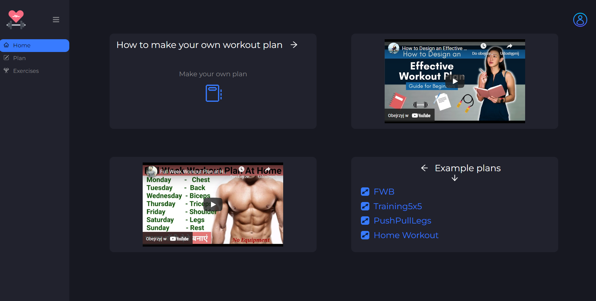
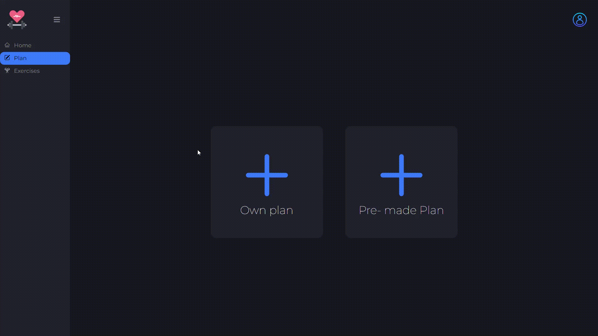
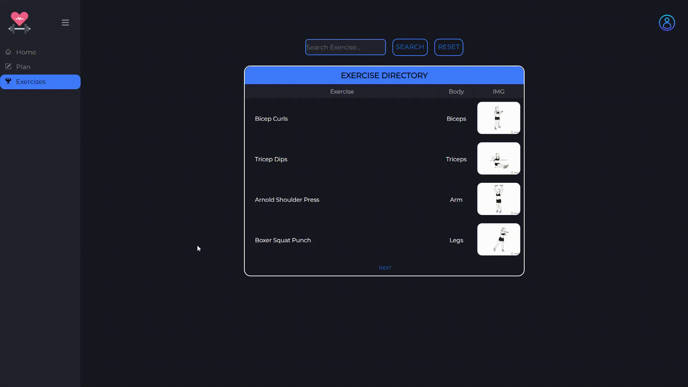

# Workout app 

## Tech Stack
- [React](https://pl.reactjs.org/)
- [React-router](https://reactrouter.com/)
- [JSON-server](https://github.com/typicode/json-server)

## Features
- Create own plan
- Remove single exercise
- Your plan will be saved in localstorage
- Search for an exercise in the directory

## Getting Started
Clone the repo and install
```bash
git clone https://github.com/Patrycjax98/Workout.git
npm install
```
Install json-server
```bash
 npm install -g json-server
```
Run the server
```bash
npx json-server --watch data/db.json --port 8000
```
Run the app
```bash
npm start
```

## Screenshots
Home


Own plan


Pre-made plan


Exercise directory

